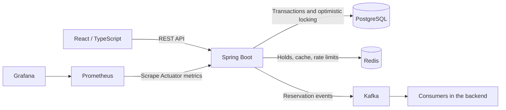
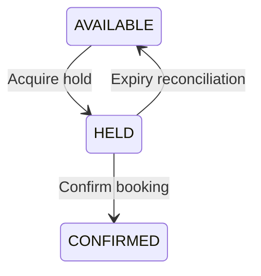

# SeatLock

**A Java and Spring Boot reservation project exploring concurrent seat holds, booking consistency, and backend observability.**

SeatLock models a venue ticketing workflow: browse an event, temporarily hold seats, and confirm a booking before the holds expire. It combines PostgreSQL transactions and optimistic locking with Redis-based holds, Kafka events, and a React interface.

The project is a local development and learning application. Its strongest focus is the interaction between concurrency, persistence, caching, and failure handling. Authentication, real payments, and production deployment are outside the current implementation.

## Implemented features

- **Seat holds:** an atomic Redis Lua script creates a five-minute hold; the service records the `HELD` state and expiry in PostgreSQL.
- **Booking confirmation:** validates Redis hold ownership, creates a booking, updates seat state, and releases Redis holds. Repeated requests with an existing idempotency key return the stored booking.
- **Expiry reconciliation:** a scheduled job returns expired database holds to `AVAILABLE`, with a 30-second fixed delay between executions.
- **Concurrency controls:** JPA `@Version` optimistic locking on seats, Redis hold acquisition, and concurrent contention tests.
- **Seat-list caching:** Redis entries with a 45-second TTL, eviction calls on state changes, and a short-lived cache-repopulation lock to reduce duplicate database reads.
- **Rate limiting:** a Redis Lua-based limit of five hold requests per user ID per ten-second window, configurable in application properties.
- **Kafka events:** `seat-held`, `seat-confirmed`, and `seat-released` topics; consumer retry handling and dead-letter topics for confirmation and release events.
- **Resilience and monitoring:** Resilience4j circuit breakers, Micrometer metrics, Spring Boot Actuator, and Prometheus/Grafana configuration.
- **Frontend:** React/TypeScript pages for event browsing, seat selection, checkout, demo payment selection, booking confirmation, and operational dashboards.
- **Testing:** JUnit integration and concurrency tests, Testcontainers configuration, a Gatling simulation, and a smaller k6 hold script.

## Technology

| Area | Components |
| --- | --- |
| Backend | Java 21, Spring Boot 3.5.6, Spring Web, Spring Data JPA, Bean Validation |
| Persistence | PostgreSQL 16, Flyway |
| Coordination and caching | Redis 7, Lua scripts |
| Messaging | Spring Kafka, Confluent Kafka 7.6.0 with ZooKeeper in local Compose |
| Resilience | Resilience4j |
| Observability | Actuator, Micrometer, Prometheus, Grafana |
| Frontend | React, TypeScript, Vite, Tailwind CSS, Axios, TanStack Query, Zustand |
| Tests and tooling | JUnit 5, Testcontainers, Gatling, k6, Maven Wrapper, Docker Compose |

## Architecture

The backend runs as one Spring Boot application, with external PostgreSQL, Redis, and Kafka services.



The intended seat lifecycle is:



Redis operations and Kafka publication are not part of the PostgreSQL transaction. The current implementation does not provide an atomic transaction spanning all three systems; see [Known limitations](#known-limitations).

## Run locally

### Prerequisites

- JDK 21, with `JAVA_HOME` configured.
- Docker Engine or Docker Desktop with Docker Compose support.
- Node.js and npm compatible with the Vite version in `frontend/package.json`.
- Git. Maven is provided through the repository's wrapper.

### 1. Clone and start infrastructure

```sh
git clone https://github.com/ShikharKothari0/SeatLock.git
cd SeatLock
docker compose up -d
docker compose ps
```

Compose starts PostgreSQL, Redis, ZooKeeper, Kafka, Prometheus, and Grafana. It does **not** start the Spring Boot backend or React frontend. The root file named `docker` is empty; it is not an application Dockerfile.

Wait for the services to finish starting before launching the backend. If needed, inspect their output with `docker compose logs kafka postgres redis`.

### 2. Start the backend

From the repository root, on Windows PowerShell:

```powershell
.\mvnw.cmd spring-boot:run
```

On macOS/Linux:

```sh
./mvnw spring-boot:run
```

Default connections in `src/main/resources/application.properties`:

| Service | Local address / setting |
| --- | --- |
| Backend | `http://localhost:8080` |
| PostgreSQL | `localhost:5432`, database `seatlock`, user `admin`, password `password` |
| Redis | `localhost:6379` |
| Kafka | `localhost:9092` |

Flyway creates the schema and inserts demo data on a fresh database. Hibernate validates the schema. The seed includes one venue, one event, 100 seats, and a demo user.

The Compose settings are for local use. PostgreSQL currently has no explicit named-volume mount, despite `postgres_data` being declared; do not rely on database data surviving container replacement. Kafka advertises localhost addresses for the host-run backend, so moving the backend into a container requires configuration changes.

### 3. Start the frontend

In another terminal:

```sh
cd frontend
npm ci
npm run dev
```

Open `http://localhost:5173`. Vite proxies `/api` requests to `http://localhost:8080`. The frontend uses the seeded demo user; it does not implement login. Payment controls are a demo interface and do not process money.

Frontend checks available in the repository:

```sh
npm run build
npm run lint
```

### 4. Inspect monitoring

| Interface | Address |
| --- | --- |
| Backend health | `http://localhost:8080/actuator/health` |
| Prometheus metrics | `http://localhost:8080/actuator/prometheus` |
| Prometheus UI | `http://localhost:9090` |
| Grafana | `http://localhost:3000` |

Grafana's local credentials are `admin` / `admin`, and provisioning files are included under `grafana/provisioning`. Prometheus targets `host.docker.internal:8080`; environments where that hostname is unavailable need an appropriate host mapping or target change.

The application has no authentication layer protecting the admin APIs. Keep this default setup local.

## API overview

| Method | Endpoint | Purpose |
| --- | --- | --- |
| GET | `/api/events` | List events |
| GET | `/api/events/{id}` | Get an event |
| GET | `/api/events/{eventId}/seats` | List seats; optional `status` filter |
| POST | `/api/seats/{seatId}/hold` | Hold one seat for the supplied user ID |
| POST | `/api/bookings/confirm` | Confirm one or more held seats |
| GET | `/api/admin/metrics/overview` | Overview metrics |
| GET | `/api/admin/metrics/cache` | Cache metrics |
| GET | `/api/admin/metrics/redis` | Redis metrics |
| GET | `/api/admin/metrics/circuit-breakers` | Circuit-breaker metrics |
| GET | `/api/admin/health` | System-health information |
| GET | `/api/admin/metrics/stream` | Server-sent metrics events |

The API includes handlers for validation errors (`400`), missing resources (`404`), unavailable seats and database integrity conflicts (`409`), and rate-limit rejection (`429`). Most handled errors return a JSON object with `message` and `timestamp`.

### Try a hold and confirmation

On a fresh local database, this PowerShell example browses seats, holds the first available seat, and confirms it:

```powershell
$apiBase = 'http://localhost:8080/api'
$eventId = '22222222-2222-2222-2222-222222222222'
$demoUserId = '33333333-3333-3333-3333-333333333333'
$seats = Invoke-RestMethod "$apiBase/events/$eventId/seats?status=AVAILABLE"
if (-not $seats) { throw 'No available seats in the demo event.' }
$seatId = @($seats)[0].id

$holdBody = @{ userId = $demoUserId } | ConvertTo-Json
Invoke-RestMethod "$apiBase/seats/$seatId/hold" -Method Post -ContentType 'application/json' -Body $holdBody

$bookingBody = @{
    userId = $demoUserId
    seatIds = @($seatId)
    idempotencyKey = [guid]::NewGuid().ToString()
} | ConvertTo-Json
Invoke-RestMethod "$apiBase/bookings/confirm" -Method Post -ContentType 'application/json' -Body $bookingBody
```

Confirm within the five-minute hold window. Reusing the same booking body demonstrates the existing sequential idempotency path. The hold response currently contains `status` and `seatId`, but no authoritative expiry timestamp.

See [Frontend Integration Guide](FRONTEND-INTEGRATION-GUIDE.md) for more API examples and UI context. That guide also contains historical implementation tasks; use the current source as the reference for what is implemented.

## Tests and evidence

Run backend tests from the repository root with Docker available and the local Compose services running:

```powershell
.\mvnw.cmd test
```

On macOS/Linux, use `./mvnw test`. Use a disposable development database: test setup resets seat state and deletes bookings in its configured database.

The suite mixes Testcontainers-based classes with tests using local service settings. In particular, `IntegrationTestBase` declares a Kafka container but overrides the application's Kafka bootstrap address to `localhost:9092`. It is therefore not a completely self-contained test setup.

Representative tests in the repository:

| Test | Assertions / behaviour exercised |
| --- | --- |
| `SeatHoldConcurrencyTest` | 200 concurrent service calls across 100 seats; expects 100 successful holds, 100 expected rejections, and the corresponding database state |
| `SeatConcurrencyTest` | 50 callers competing for one seat; expects one successful hold |
| `BookingIdempotencyTest` | Sequential repeated confirmation with the same key returns the same booking |
| `FullSystemIntegrationTest` | Hold/confirm flow, database state, Redis release, and Kafka event capture |
| `RateLimiterServiceTest` | Per-user request limits and independent user counters |
| `CircuitBreakerIntegrationTest` | Redis circuit-breaker opening, fallback, and recovery |
| `DltIntegrationTest` | Failed consumer messages reaching a dead-letter topic |

These are integration and concurrency test scenarios, not a claim of complete unit-test coverage. The 200-thread test calls the service directly and does not measure HTTP endpoint throughput. The assertions describe the current source; consult a fresh test run for pass/fail results. The repository currently has no GitHub Actions workflow reporting those results automatically.

### Load-test status

Gatling source is in `src/test/scala/seatlock/SeatLockSimulation.scala`. With the backend running, the configured simulation can be invoked with:

```powershell
.\mvnw.cmd test-compile gatling:test
```

The current script needs correction before it can demonstrate a complete booking workload:

- The hold request does not save `holdStatus`, so the conditional confirmation step is skipped.
- The confirmation body references a session `userId` that is not populated.
- The shared user ID interacts with the hold endpoint's rate limit, so a sustained run can also produce `429` responses.
- The hold check accepts both `200` and expected `409` conflicts; a request classified as successful by the load test is not necessarily a successful seat hold or booking.

[Load-test notes](docs/load-test-results.md) record earlier local measurements. Treat them as historical observations requiring reconciliation with a corrected script and fresh reports, rather than a verified end-to-end capacity benchmark. The smaller `k6/hold-test.js` script is also present for hold-request experiments.

## Known limitations

- **Demo identity and payments:** user IDs come from requests, the UI uses a fixed demo identity, and there is no authentication, authorization, or payment-provider integration.
- **Redis outage behaviour:** the hold fallback allows database-only holding, but confirmation still relies on Redis ownership data. Full booking continuity during a Redis outage is not implemented.
- **Transaction boundaries:** Redis hold release, cache eviction, and Kafka publication occur within service methods before the database transaction has necessarily committed. Kafka send failures are logged; there is no transactional outbox or durable publication retry mechanism.
- **Lock ownership:** seat-hold release deletes the Redis key without an atomic ownership check. The cache-repopulation lock uses a separate read and delete. Expiry/reacquisition races need dedicated tests and ownership-safe release logic.
- **Idempotency scope:** existing-key lookup returns a stored booking without checking that the new payload matches it. Simultaneous first requests with the same key and payload conflicts need stronger handling and tests.
- **Metrics streaming:** SSE clients share one scheduler, and a client's completion shuts it down. Disconnect/reconnect and multiple-client behaviour need correction.
- **Local operations:** no application container image, Kubernetes manifests, GitHub Actions workflow, or production deployment pipeline is included. The Compose stack is a single-machine development setup.

## Next improvements

1. Correct the Gatling session handling, use suitable test identities and rate-limit settings, and publish reproducible booking results.
2. Define consistent Redis-outage behaviour, make lock release ownership-safe, and add regression tests for expiry and retry races.
3. Make test infrastructure self-contained, add focused unit tests, and run checks in CI.
4. Add a transactional outbox and stronger idempotency validation.
5. Fix SSE connection lifecycle handling, then add authentication and authorization before considering a shared deployment.

## Repository guide

```text
src/main/java/.../SeatLock/   Controllers, services, entities, repositories, Kafka, configuration
src/main/resources/          Application settings, Flyway migrations, Redis Lua scripts
src/test/java/               Integration, concurrency, repository, and service tests
src/test/scala/              Gatling simulation
frontend/                   React and TypeScript application
docs/                       Architecture diagrams and historical load-test notes
grafana/provisioning/        Grafana dashboard and data-source configuration
k6/                         Hold-request load script
docker-compose.yml          Local infrastructure
prometheus.yml              Metrics scraping configuration
```

Additional diagrams: [Booking state machine](docs/Booking%20State%20Machine.png) and [ER diagram](docs/ER-Diagram.png).

---

Maintained by [Shikhar Kothari](https://github.com/ShikharKothari0). This description was checked against the source on `master` at commit `a3a69d22db57774a1da0e522cd9c885f4f88d022`.
